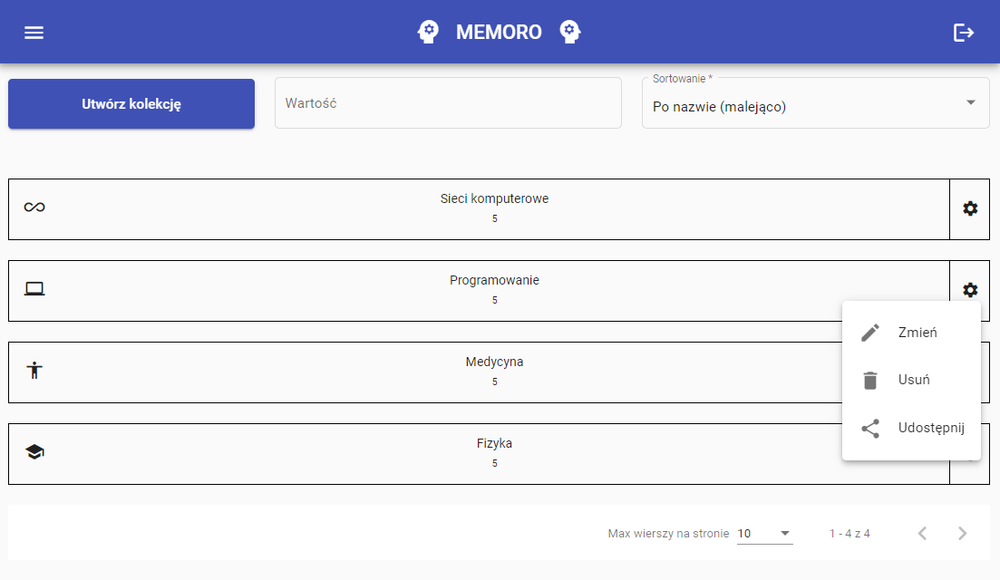
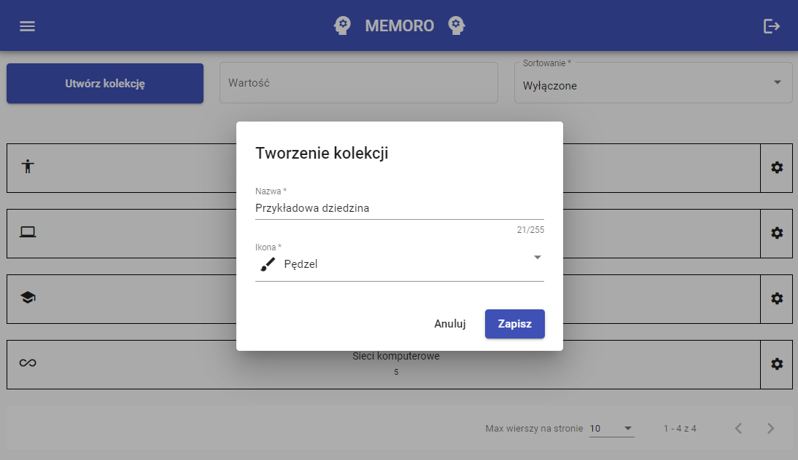
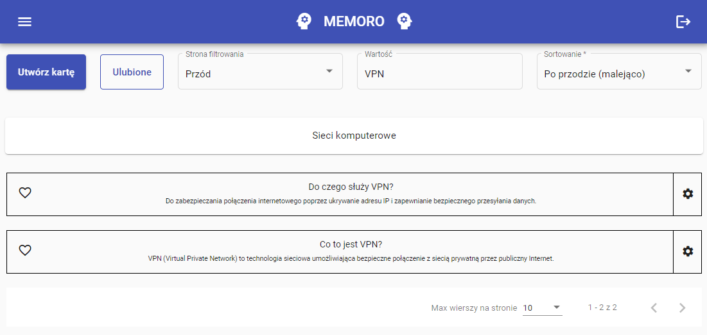
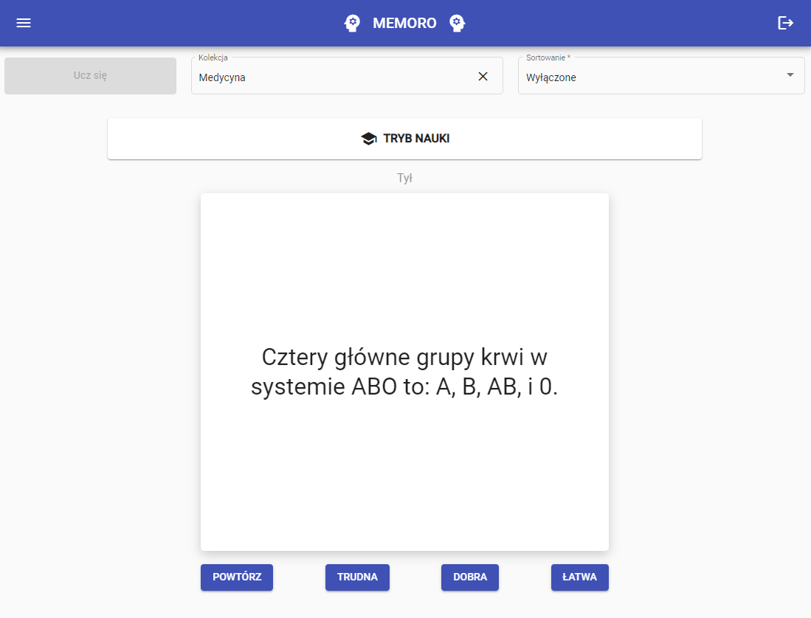
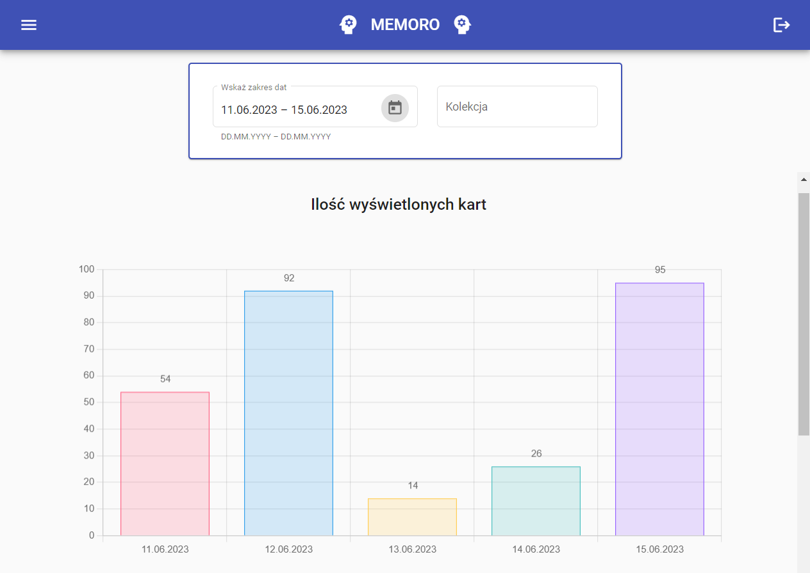

# Memoro

Project carried out for master's degree. 
Web application (backend side) written in Java 17 and Spring Boot 3.

Main object was to implement simple application to support learning and effective memorization of information.
The SM-2 (SuperMemo2) algorithm was used for this purpose.

## Description

Memoro is an application that enables much more effective learning using techniques and tools such as memory information extraction, forgetting curve and spaced repetition. 

It works on the basis of fiches. Users can create their own collections and fiches for learning. 

The SM2 algorithm determines the optimal repetition time maximizing learning results. 

There are also graphs / statistics (e.g. from the number of cards displayed / learned) and also functionality to share collections with other users.

## Technological stack

**Java** and **Spring Boot** - core technologies

**Envers** - used for storing historical data and extracting statistics

**QueryDSL** - a library that facilitates the creation of complex queries

**PostgreSQL** - relational database that was used to store data

## Images

  Expand to show images!

    
  

    
  

    
  

    
  

    

